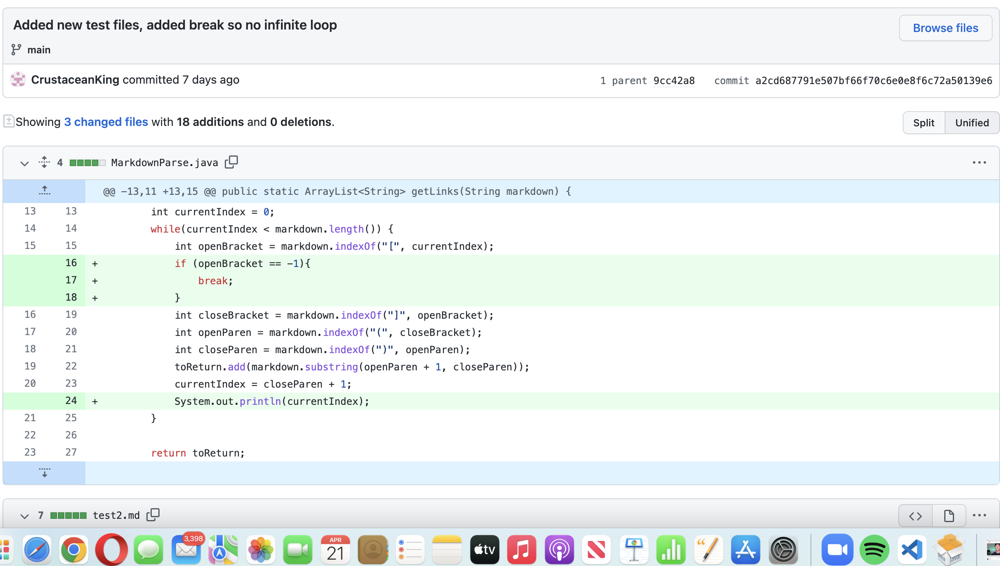
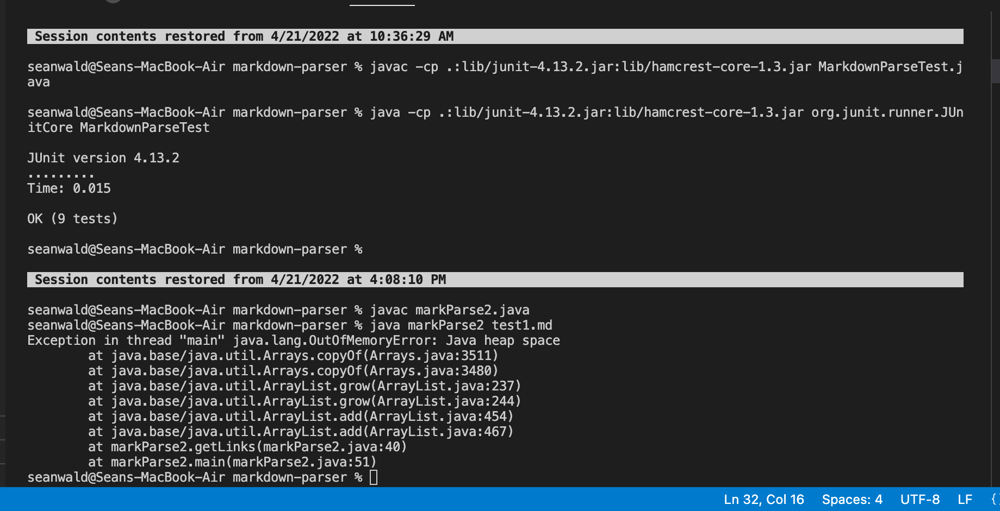
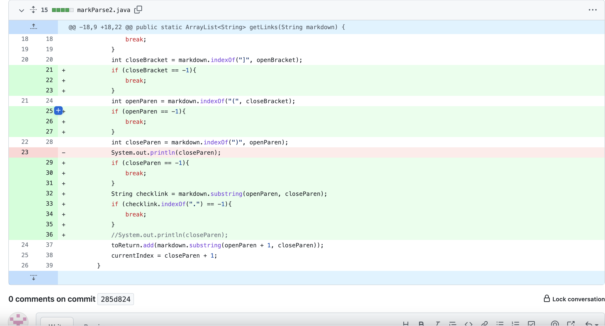
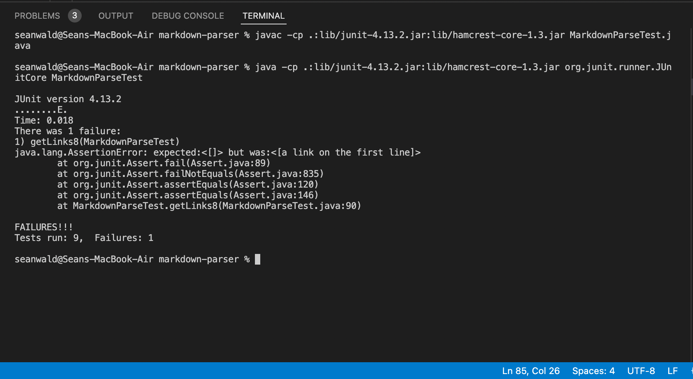
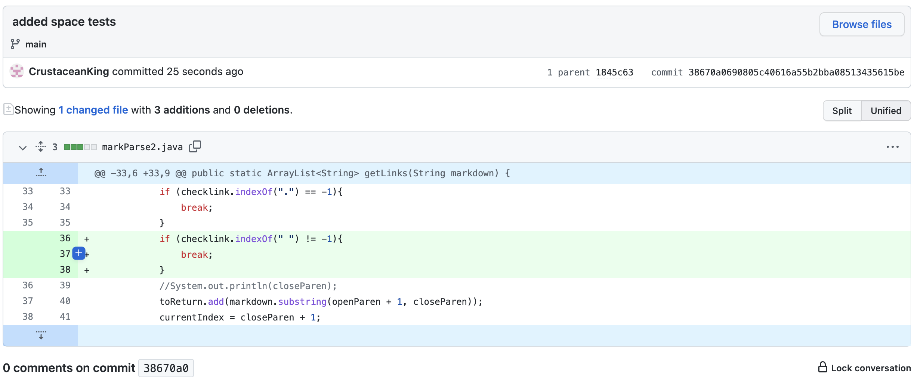
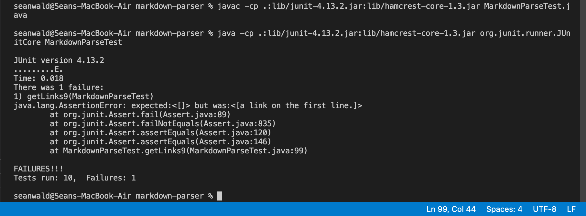

Lab 3: 3 changes made to code

(Sean) Thomas Wald

# First change:

**Test file;**

[failure1](https://github.com/CrustaceanKing/markdown-parser/blob/main/test-file.md)

**Symptoms of failure;**
Our of memory error when code tries to complie, infinite loops causes code to crash

for the first error, the code would infinitely loop because if there were no more brackets or parenthesis, the code would assign the instance variables a value of -1.
Because there was no check if they were -1, it would infinitely loop and eventually cause an out of memory error. This was fixed by adding a break statement when the code did assign instance variables a value of -1, so that it never loops.

# Second change:

**Test file;**

[failure2](https://github.com/CrustaceanKing/markdown-parser/blob/main/test-file8.md)

**Symptoms of failure;**
if the link encapsulated in parenthesis was not a link, it would still add 
**Ex:** 
given "[link](enter link here)"
it would add "enter link here" when it should've added nothing

**Fix;**
I added a statement to check if a period exists in the substring inbetween the parenthesis (like htpps//github.com or smth, where there is a period), this made sure that it adds out only links

# Third change

**Test file:**

[failure3](https://github.com/CrustaceanKing/markdown-parser/blob/main/failure3.md)

**Symptoms of failure;**
What happened was the last fix worked if the thing inside the parenthesis was not a link, or rerally that was supposed to be how it worked but if a phrase had a period (like an end of sentence), then it would still be included, causing the wrong thing to be added to the array
**Ex:**
given "[link](enter link here.)"
it would add "enter link here." when it should've added nothing

**Fix:**
added a check so that if the substring contains " " (spaces don't exist in links, but do exist in sentences), then it breaks
