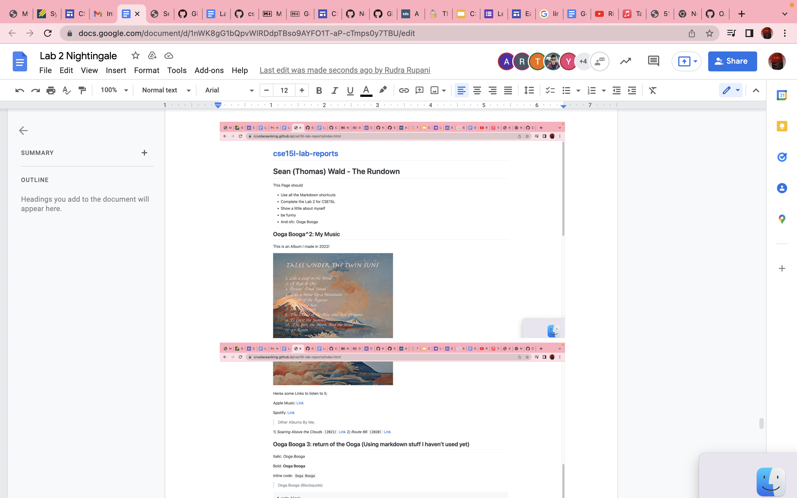

# Lab report 1

Screenshot-ception

See full doc for my lab report, I am Thomas Wald, I'm not inclujding all images because You guys told me last minute that the lab report should be on here, which makes no sense as to why we should do it twice. For credit, waste your own time looking at this not mine for having to do it twice

back to main 
![page] (https://crustaceanking.github.io/cse15l-lab-reports/)
