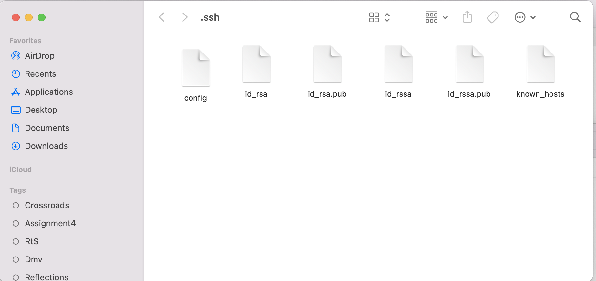
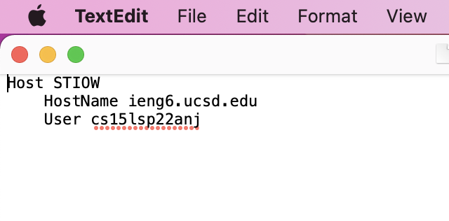
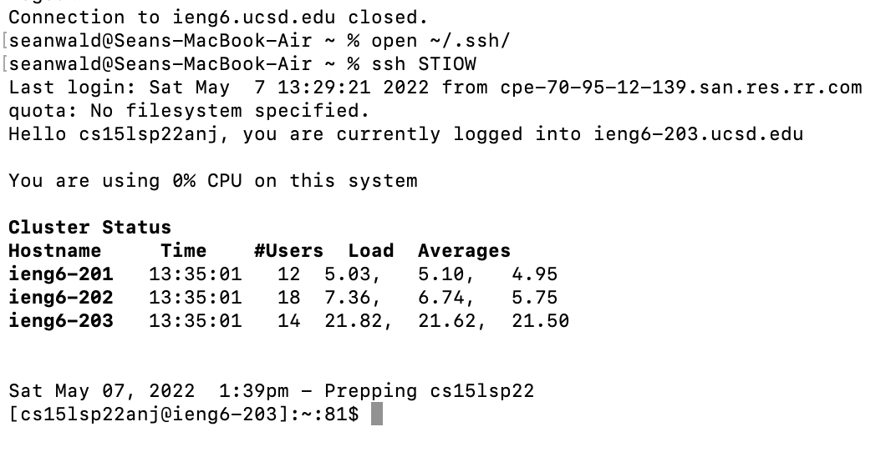
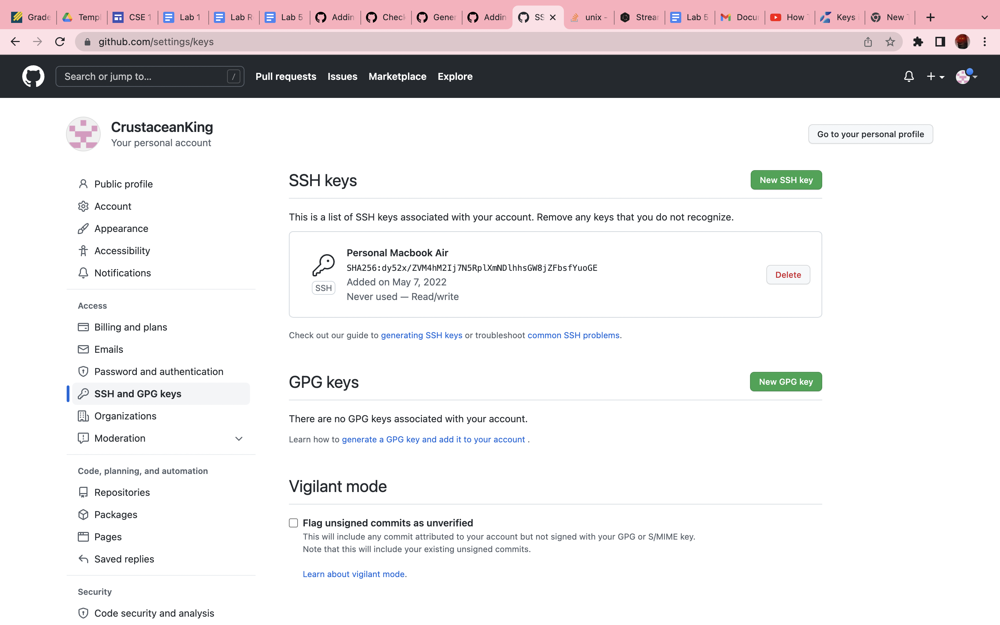
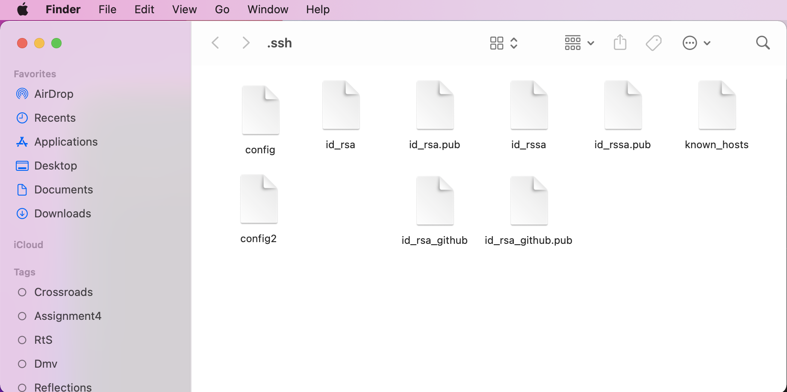
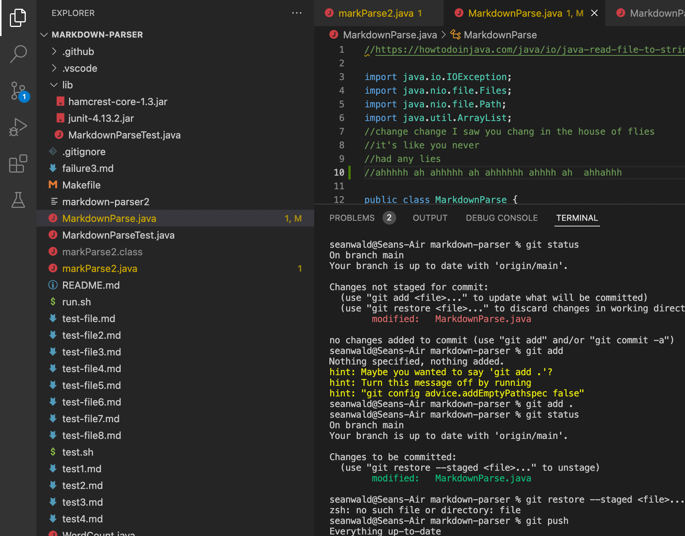
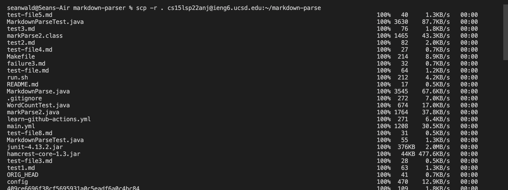
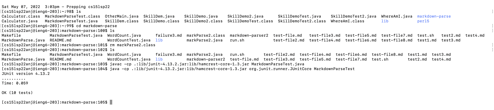
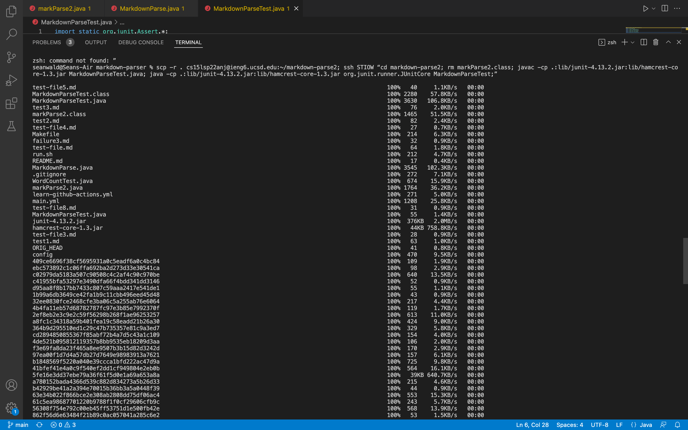
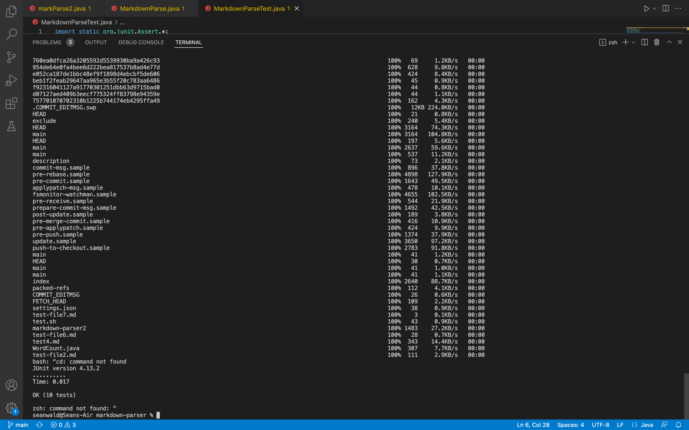

# Lab Report 3
Week 6

Sean Thomas Itto Orion Wald

## Streamline ssh congif

Note: I made my alias STIOW - Sean Thomas Itto Orion Wald (my name)

### ssh Config file:

edited with mac TextEditor:

### ssh login to acc:

### scp using alias:
![Image] ooga booga (Lab6_4.png)

## Githu Access from ieng6

-note, directions were particularly bad for this step

### public key screenshot:

### private key:

### running git commands

### link for resulting commit
[link](https://github.com/CrustaceanKing/markdown-parser/commit/a05eb1089f0ec48650bb1539c0f98e73fd7f864c)

## copy directories

### copy whole markdow-parse to ieng6

### compile and tun tests on ieng6

### combining scp ; and ssh to copy whole directory and run tests on one line

what I wrote:

scp -r . cs15lsp22anj@ieng6.ucsd.edu:~/markdown-parse2; ssh STIOW “cd markdown-parse2; rm markParse2.class; javac -cp .:lib/junit-4.13.2.jar:lib/hamcrest-core-1.3.jar MarkdownParseTest.java; java -cp .:lib/junit-4.13.2.jar:lib/hamcrest-core-1.3.jar org.junit.runner.JUnitCore MarkdownParseTest;”

