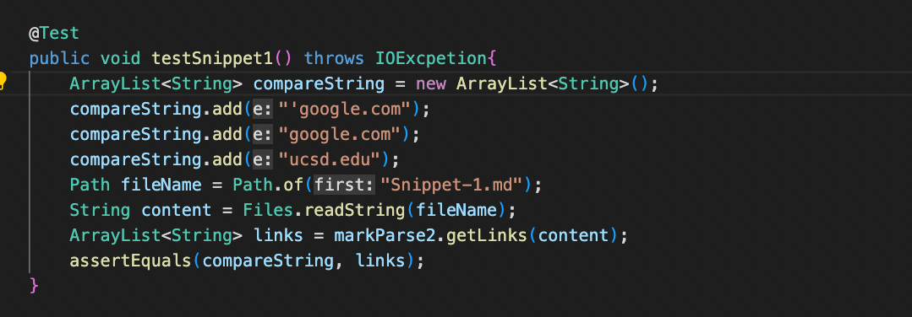
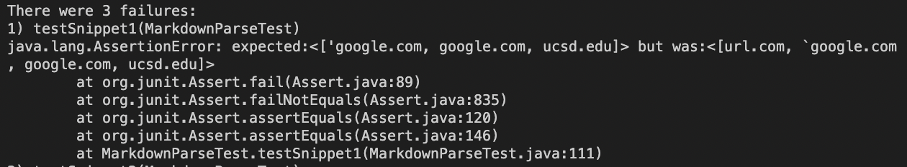
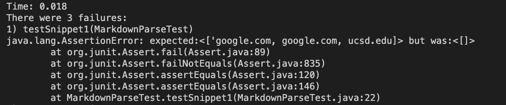
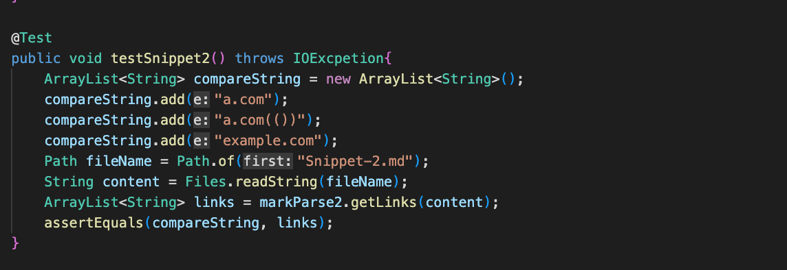
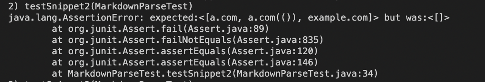
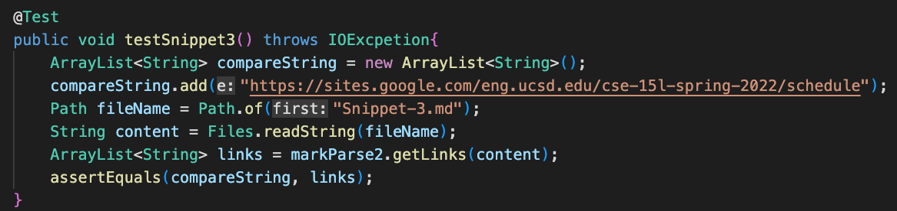
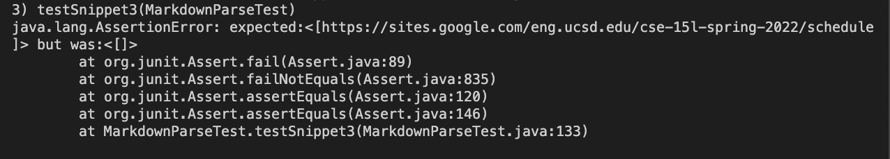
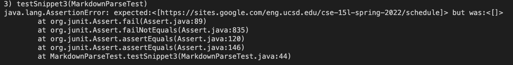

# Lab Report 4

Link to my repo: [myRepo](https://github.com/CrustaceanKing/markdown-parser)

Link to other group repo: [theirRepo](https://github.com/NuojinliXu/mq`arkdown-parser)

## Test 1

**What should the result be? :**

based on the preview window in VSCode, the first "link" is not a link, but the other three are, so it should only pick up the last three as "'google.com", "google.com", & "ucsd.edu" 

**Picture of Test Code**

**My Code - Pass/No Pass w Picture:**

Unfortunately, My code did not pass this test. It picket up on the first link, "url.com" (which was invalid), and thus asserted false when compared to the expected output

**Other Group - Pass/No Pass w Picture:**

Unfortunately the other group did not pass either, as with all the tests none of the links got added at all, resulting in an empty array

## Test 2

**What should the result be? :**

Based on the preview in VSCode, all the links are technically valid, having a.com, then a.com(()), finally example.com

**Picture of Test Code**

**My Code - Pass/No Pass w Picture:**

Unfortunately, My code did not pass this test. In the second link, 'a.com(())', it did not pickup the last two parenthesis, instead getting 'a.com(('.

**Other Group - Pass/No Pass w Picture:**

Unfortunately the other group did not pass either, as with all the tests none of the links got added at all, resulting in an empty array

## Test 3

**What should the result be? :**

based on the preview in VSCode, the only valid link was https://sites.google.com/eng.ucsd.edu/cse-15l-spring-2022/schedule, so ideally, that will be the only code that is picked up

**Picture of Test Code**

**My Code - Pass/No Pass w Picture:**

Unfortunately, My code did not pass this test. The code did not pick up anything at all, whereas it was supposed to get the one long link

**Other Group - Pass/No Pass w Picture:**

Unfortunately the other group did not pass either, as with all the tests none of the links got added at all, resulting in an empty array

## Follow up Questions:

**1. is there a small code change that will make the code work for snippet 1. If yes, describe the code change. If not, describe why it would be a more involved change.**

**2. is there a small code change that will make the code work for snippet 2. If yes, describe the code change. If not, describe why it would be a more involved change.**

**3. is there a small code change that will make the code work for snippet 3. If yes, describe the code change. If not, describe why it would be a more involved change.**
