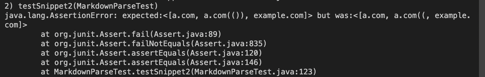

[Return to home page](https://crustaceanking.github.io/cse15l-lab-reports/Lab-reports.html)
# Lab Report 4

Link to my repo: [myRepo](https://github.com/CrustaceanKing/markdown-parser)

Link to other group repo: [theirRepo(Forked as Mine)](https://github.com/CrustaceanKing/Week7MarkParse-Theirs)

## Test 1

**What should the result be? :**

based on the preview window in VSCode, the first "link" is not a link, but the other three are, so it should only pick up the last three as "'google.com", "google.com", & "ucsd.edu" 

**Picture of Test Code**

**My Code - Pass/No Pass w Picture:**

Unfortunately, My code did not pass this test. It picket up on the first link, "url.com" (which was invalid), and thus asserted false when compared to the expected output

**Other Group - Pass/No Pass w Picture:**

Unfortunately the other group did not pass either, as with all the tests none of the links got added at all, resulting in an empty array

## Test 2

**What should the result be? :**

Based on the preview in VSCode, all the links are technically valid, having a.com, then a.com(()), finally example.com

**Picture of Test Code**

**My Code - Pass/No Pass w Picture:**

Unfortunately, My code did not pass this test. In the second link, 'a.com(())', it did not pickup the last two parenthesis, instead getting 'a.com(('.

**Other Group - Pass/No Pass w Picture:**

Unfortunately the other group did not pass either, as with all the tests none of the links got added at all, resulting in an empty array

## Test 3

**What should the result be? :**

based on the preview in VSCode, the only valid link was https://sites.google.com/eng.ucsd.edu/cse-15l-spring-2022/schedule, so ideally, that will be the only code that is picked up

**Picture of Test Code**

**My Code - Pass/No Pass w Picture:**

Unfortunately, My code did not pass this test. The code did not pick up anything at all, whereas it was supposed to get the one long link

**Other Group - Pass/No Pass w Picture:**

Unfortunately the other group did not pass either, as with all the tests none of the links got added at all, resulting in an empty array

## Follow up Questions:

**1. is there a small code change that will make the code work for snippet 1. If yes, describe the code change. If not, describe why it would be a more involved change.**

Looking at my code and then at the expected output, I think one check I could make in the future would be to take the substrings of both the text inside the bracks and the test in the parenthesis, and see if there are two backticks or 0 backticks (or any number of backticks %2). If there is, then it means the code is valid because all the backticks are contained within the brackets/parenthesis and it wont throw any errors, and if not I can simply have a break statement. However, I'm realizing the entire code could be surrounded by backticks, so maybe on top of the previous statements adding a check to see if the characters before and after the link md statement are backticks, and if they are breaking. I don't know if this would be less than 10 lines, but I do this it's doable.

**2. is there a small code change that will make the code work for snippet 2. If yes, describe the code change. If not, describe why it would be a more involved change.**

The only problem with this code was the nested parenthesis in a.com(()), which assumed that the last parenthesis was the end of the link. I'm not sure what I could do for this one, as I could check if there is another close parenthesis after the last one and then stop there, but if there was something like a.com(yo mama(joe)), it wouldn't work b/c of the text inbetween parenthesis. However, if I check fo the next close prenthesis always regardless of distance, it might go to the next link or out of bounds, throwing massive errors. The only realistic way I could see this working is to assume a.com(()) is an invalid link (which it may not be), and therfore chekcing if an open parenthesis exists in the link snippet, (in my case "a.com((" ), and if it does breaking. That would be less than 10 lines, but the other algorithm might end up being like 5 or so helper methods of code. Neddless to say this is a difficult check to implement correctly.

**3. is there a small code change that will make the code work for snippet 3. If yes, describe the code change. If not, describe why it would be a more involved change.**

My code picked up nothing for this confusingly, I believe this is due to my code having a check that if a link contains a space then it is invalid (this was assuming the link was a sentence and not a link at all). However, this link has a new line character (enter key), which I guess counted as a space by my code and therefore considered the link invalid. What's even stranger is that technically that logic should work and in markdown that link should be invalid, so the fact that the link is valid changes my entire precetpion of links in markdown. A fix code may be to check inside the check for an empty space character if the code contains the "/n", and if it does not breaking but adding the substring, however I'm not entirely sure this will work because a) I don't know if "/n" is the newline text in markdown, b) if it's not, I don't know how markdown represents newline, and c) what if a link has a newline (and it's some sort of character) but it has a space in the link anyways making it invalid. Just throughts to consider, I do think this would take more than 10 lines to implement however.

**Additional thoughts on changes**

One important check I realized my code was missing (that was not tested in this code) was that the end of the brackets and beginning of parenthesis need to be directly in successtion. I.e, "[edit this file to see the link](a.com)" is a valid link but "[] (a.com)" is not. That would be a simple chack saying like if the index + 1 of the end bracket is equal to "(", then continue, if not break.
