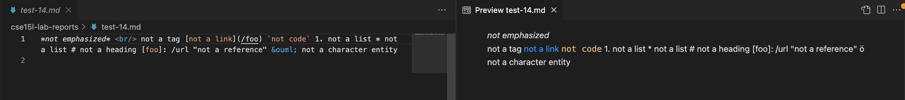
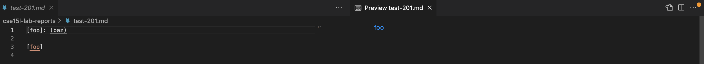

[Return to home page](https://crustaceanking.github.io/cse15l-lab-reports/Lab-reports.html)

# Lab Report 5

choose two differing tests, compare the code, see which is right/wrong and explain

## How I found the Test

>vimdiff, bash for loop, search manually, other way?

## Link to test files

Test 14: [14](https://github.com/nidhidhamnani/markdown-parser/blob/main/test-files/14.md)

Test 201: [201](https://github.com/nidhidhamnani/markdown-parser/blob/main/test-files/201.md)

# Test 1: File 14 

Test Number 14

## Comparison screenshot

## Expected Output

**What should it produce?**

As we see from the image, the only link that the markdown picked up was what was comtained in "not a link", which happened to be /foo. So while technically /foo itself if not a link, makrdown believes it to be a valid link, therefore it should be picked up by the parser, and the expected output should be  "[/foo]"

## Which Test is Correct?

## For Incorrect Implementation, describe bug

# Test 2: File 201

Test Number 201

## Comparison screenshot

## Expected Output

**What should it produce?**

Again with the last test, we see that markdown sees the "[foo]" followed by a colon, followed by (baz) as a valid link, and picks up the link baz with a title foo. Even though as with the last test "baz" itself is not a valid link, and if we click on it we get a "404 page not found", because markdown think's it is a link the expected output should pick this up and therefore be "[baz]"

## Which Test is Correct?

## For Incorrect Implementation, describe bug
