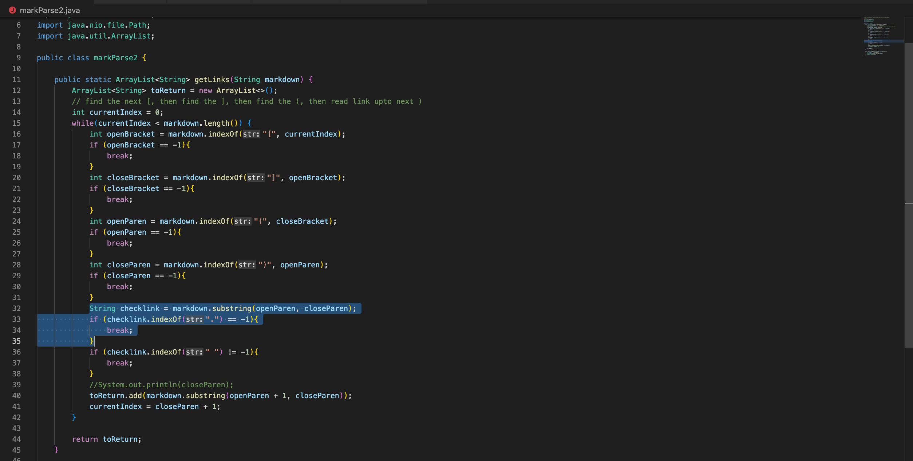
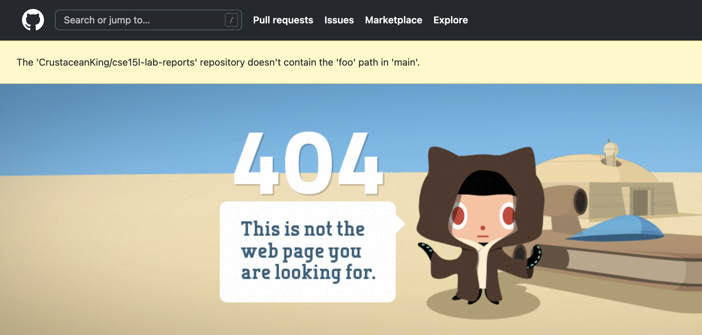
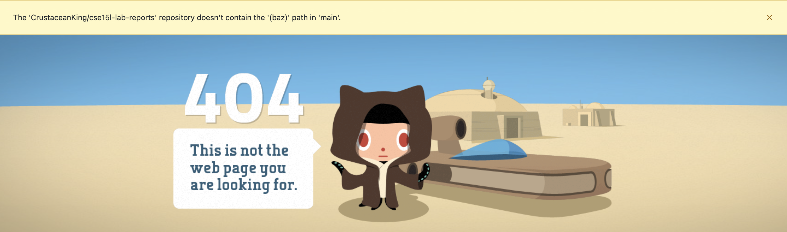

[Return to home page](https://crustaceanking.github.io/cse15l-lab-reports/Lab-reports.html)

# Lab Report 5

choose two differing tests, compare the code, see which is right/wrong and explain

### How I found the Test Files to Compare

How I went about finding the test files to compare was first for each repository containing the different markdown tests, I added a `script.sh`, which compiled the markdown parser on all 1000+ test files, then I ran `bash script.sh` and added the result to a file called `results.txt` (command line would be " `time bash script.sh > results.txt` ". This file would contain what the markdown would compile for each specific test file, for all test files (which was over 1000!)

Now that I had done this for each repository, meaning I had two different results.txt, each having the 1000+ files compiled on the specific repositories version of the markdown parser, I used vimdiff to compare them.

The command was: `vimdiff my-markdown-parser/results.txt cse15lsp22-markdown-parser/results.txt`

This allowed me to compare them side by side and see any differences. Two main ones I noticed were test 14, and test 201, so I will be looking at those

### Link to Test Files Used

Test 14: [14](https://github.com/nidhidhamnani/markdown-parser/blob/main/test-files/14.md)

Test 201: [201](https://github.com/nidhidhamnani/markdown-parser/blob/main/test-files/201.md)

# Test 1: File 14 

Test Number 14

[Test File](https://github.com/nidhidhamnani/markdown-parser/blob/main/test-files/14.md)

### Comparison Screenshot

As we can see, the difference on test 14 between my code and the given code is that my code did not pick up "/foo" and a valid link, whereas the given code did

### Expected Output

**What Should it Produce?**

As we see from the image, the only link that the markdown picked up was what was comtained in "not a link", which happened to be /foo. So while technically /foo itself if not a link, makrdown believes it to be a valid link, therefore it should be picked up by the parser, and the expected output should be  "[/foo]"

### Which Test is Correct?

Simply based on Markdown rules, the given test was correct, and my test was incorrect. Comparing to the image above, the only link returned should have been "/foo", which the given code returned but my code not. Therefore simply by markdown standards, the given code test is correct

### For Incorrect Implementation, Describe Bug

Ironcially, the reason my code did not work is because it is more correct than markdown itself, which sounds cocky but let me explain. In my code, as seen below, markParse2 (my markdown file) has a check to see if the link contains a "." character, and if it doesn't skip this link.

This is because in my mind a valid link would have to include some type of domain, such as .org, .edu, .gov, etc., which all have a "." seperating the domain from the rest of the link, therefore any links not containing the character "." were invalid, which for the most part is true! As we see with /foo, when we click on it we get a "404 Page Not Found"

However, while this is *accurate*, it fails to consider that eventhough */foo is not a valid link*, **the markdown langauge will still pick it up as a valid link**. So for this to be a 100% accurate **markdown parser**, my code should have picked up the link, which is an easy fix as all I would need to do is delete the highlighted line above. Without a check of the ".", this link should've been picked up.

# Test 2: File 201

Test Number 201

[Test File](https://github.com/nidhidhamnani/markdown-parser/blob/main/test-files/201.md)

### Comparison Screenshot

As we can see, the code outputs differ here as my code did not pcik up "baz" as a valid link, whereas the given code did

### Expected Output

**What Should it Produce?**

Again with the last test, we see that markdown sees the "[foo]" followed by a colon, followed by (baz) as a valid link, and picks up the link baz with a title foo. Even though as with the last test "baz" itself is not a valid link, and if we click on it we get a "404 page not found", because markdown think's it is a link the expected output should pick this up and therefore be "[baz]"

### Which Test is Correct?

Simply based on Markdown rules, the given test was correct, and my test was incorrect. Comparing to the image above, the only link returned should have been "baz", which the given code returned but my code not. Therefore simply by markdown standards, the given code test is correct

### For Incorrect Implementation, Describe Bug

Again, the reason my code did not pick up this link was because it's too accurate: It does not include links that do not contain a domain, as checked by the existance of a "."

Also again, this is technically, correct: "baz" is not a valid link as seen below (Also note how it's Obi Wan on Tatooine, probably because of Kenobi, which is 8/10 ngl, but I just found that funny)

However, because markdown thinks this to be a valid link and because this is a markdown parser, it should have picked up that link. Therefore to make a more correct markdown parser, I would have to deleted the highlighted line of code above so that the parser does not check if the link contains a ".". In other words, I was checking if a link was a valid link, but markdown does not do that, therefore my markdown parser should not do that either.
